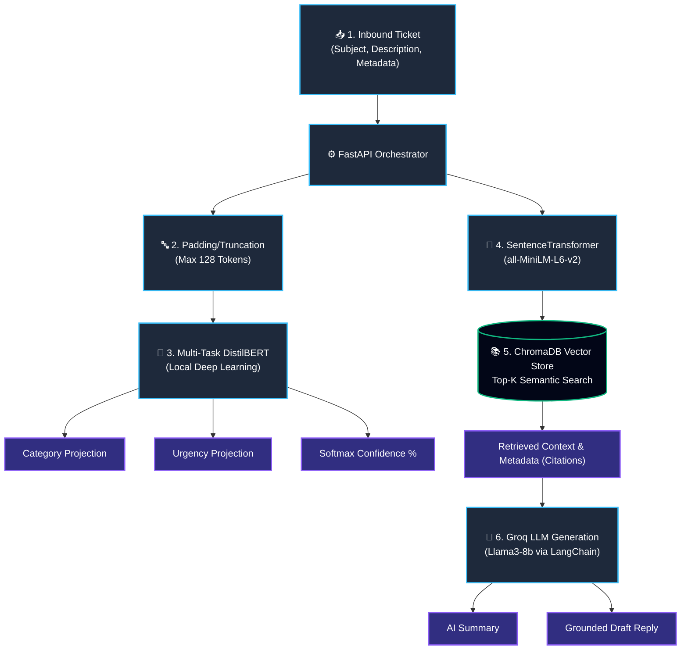

# 🤖 HelpDeskAi
### AI-Powered Customer Support Ticket Orchestrator & Auto-Responder

---

## 📖 Project Abstract

**HelpDeskAi** is an intelligent, edge-capable customer support orchestration pipeline built for the Synthetix 4.0 Hackathon. 

The system relies on a hybrid AI architecture that combines the rapid inference of specialized Deep Learning models with the nuanced reasoning of Large Language Models. At its core sits a custom **Multi-Task `DistilBERT` classification model** trained to simultaneously predict a support ticket's category and its relative urgency. When a ticket arrives, the framework routes it through the neural network while simultaneously vectorizing its contents to perform a semantic search against a local **ChromaDB Knowledge Base**. In the final step, the system uses **Retrieval-Augmented Generation (RAG)** via LangChain and the Groq API (Llama3-8b) to synthesize a highly accurate, grounded draft response for human agents.

## ✨ Key Features (100% Core Requirements Complete)

*   🧠 **Dual-Headed DistilBERT Architecture:** Utilizes a PyTorch Multi-Task learning model that outputs both `Category` and `Urgency` in a single forward pass, doubling inference speed.
*   📐 **Confidence Math (Softmax):** Converts raw Neural Network logits into clean, human-readable confidence percentages.
*   📚 **Omni-Format Knowledge Base (RAG):** Automatically parses, chunks, and locally embeds company policies from `.txt`, `.md`, and **`.pdf`** formats.
*   📝 **Anti-Hallucination Guardrails:** Employs a zero-tolerance Llama3 prompt that forces the LLM to output *"I need more clarification to resolve this."* if the Vector DB cannot provide relevant KB citations.
*   ⚙️ **Fully Automated FastAPI Backend:** Exposes a robust JSON endpoint that accepts ticket metadata (`subject`, `description`, `timestamp`, `channel`) and returns classifications, a 1-sentence AI summary, the drafted reply, and citation sources.

---

## 🏗️ Architecture Workflow

Here is exactly how a ticket flows through the HelpDeskAi ecosystem:

---

## 📊 Data Engineering & Datasets

To ensure the classifier models were robust and battle-tested, we abandoned synthetic mock data and heavily engineered real-world customer support structures.

**The Multilingual Dataset Migration**
We integrated the comprehensive `Tobi-Bueck/customer-support-tickets` dataset dynamically hosted on HuggingFace. 
1.  **Extraction:** Created `preprocess_hf.py` to securely download data partitions via the HuggingFace `datasets` library.
2.  **Transformation:** Consolidated subjects and descriptive bodies into unified contexts, mapped exact taxonomic categories (`Incident`, `Problem`, `Change`, `Request`), and procedurally synthesized Urgency ratings based on internal ITIL matrices.
3.  **Loading:** The resultant 5,000+ ticket subset was then fed into our PyTorch `train_classifier.py` pipeline for multi-epoch, localized CPU fine-tuning.

---

<i>Built for the Synthetix 4.0 Hackathon</i>

